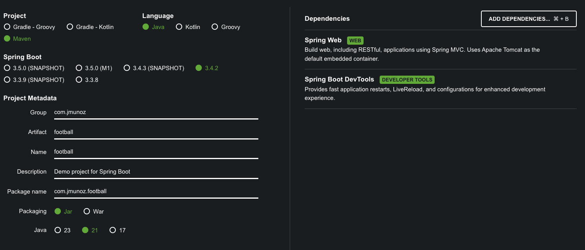

# SPRING BOOT 3 COOKBOOK

Creación de un sistema para gestionar un juego de intercambio de cartas de fútbol.

Se usa la arquitectura MVC y RESTful endpoints.

Se crean tests y se usa Postman.

## Creación de proyecto

Uso Spring Initializr: `https://start.spring.io/`



## Ejecución del proyecto

- Clonar/descargar el proyecto
- Ejecutar el proyecto con el comando: `./mvnw spring-boot:run`
  - O ejecutar directamente desde IntelliJ Idea
- Ejecutar los tests con el comando: `./mvnw test`
  - O ejecutar directamente desde IntelliJ Idea
  - O se ejecutan los goals `package` o `install` de Maven, salvo que explícitamente se deshabilite la ejecución de tests
- En la carpeta `postman` se encuentran los endpoints para probar
- Descripción OpenAPI: `http://localhost:8080/v3/api-docs`
- Interfaz OpenAPI: `http://localhost:8080/swagger-ui/index.html`

## Creación de Controller

Creo el paquete `controllers` y dentro el controller `PlayerController.java`.

Indicamos la anotación `@RestController` a la clase, para que Spring Boot lo registre en su contenedor de dependencias.

Añadimos también la anotación `@RequestMapping` para informar al contenedor web que mapee las peticiones HTTP a su handler, en este caso la clase `PlayerController`.

Mapeamos peticiones a sus métodos handling:

- @GetMapping: mapea una petición GET a un método
- @PostMapping: mapea una petición POST a un método
- @PutMapping: mapea una petición PUT a un método
- @DeleteMapping: mapea una petición DELETE a un método

Para usar toda la información de una petición HTTP podemos usar las siguientes anotaciones:

- @PathVariable: mapea una parte del path de la petición HTTP al argumento del método
- @RequestBody: mapea el body de la petición al argumento del método
- @RequestHeader: mapea las cabeceras de la petición al argumento del método
- @RequestParam: mapea parámetros de la petición, como parámetros query string, form data, o parts in peticiones multipart

## Definiendo respuestas y el modelo de datos expuesto por la API

Añadimos códigos de respuesta HTTP estándar, un modelo de datos consistente y un servicio para proveer las operaciones que usa la API.

Creamos un paquete `model` y dentro el record `Player.java` que es nuestro nuevo modelo de datos.

- Los record de Java proveen una forma conveniente de declarar clases que son soportes de datos simples, y que generan automáticamente métodos como `equals()`, `hashCode()` y `toString()`
- Spring Boot automáticamente serializa este objeto en un response body que puede enviarse al cliente en un formato JSON o XML
- Spring Boot usa un message converter para realizar esta serialización
- Por defecto, Spring Boot serializa la respuesta como JSON
- Si tenemos requerimientos especiales de serialización, podemos configurar nuestro propio message converter implementando `WebMvcConfigurer` y sobreescribiendo el método `configureMessageConverters()` 

Creamos un paquete `exceptions` y dentro dos fuentes, `AlreadyExistsException.java` y `NotFoundException.java`.

Creamos un paquete `services` y dentro el service `FootballService.java`.

Esta clase se ha anotado con `@Service`. Esto registra la clase como un bean de Spring y lo deja disponible al contenedor de inversión de control.

Modificamos `PlayerController.java` para usar nuestro service y exponer el nuevo modelo de datos creado.

- Spring Boot maneja por defecto los códigos de estado HTTP de la siguiente forma:
  - 200 - la ejecución ocurre sin generar excepciones
  - 405 Method not allowed - si un método no está implementado por el endpoint
  - 404 Not found - si se intenta acceder a un recurso que no existe
  - 400 Bad Request - si la petición no es válida
  - 500 Internal Server error - si ocurre una excepción
  - 401 Unauthorized o 403 Forbidden - relacionados con la seguridad

## Gestión de errores en un RESTful API

Vamos a gestionar errores comunes (excepciones) y devolver códigos de respuesta consistentes que siguen los estándares.

Modificamos el controlador `PlayerController.java` para gestionar las excepciones.

Si no gestionamos las excepciones, el error devuelto es un Internal Server error (500), que no se adhiere al estándar RESTful API.

Para realizar esta gestión se usan las siguientes anotaciones:

- @ExceptionHandler: para añadir un handler method y gestionar un tipo de excepción específico
- @ResponseStatus: gestiona el HTTP status code que se devuelve en este method handler específico

Es posible controlar los códigos de respuesta de forma más explícita en el código. En vez de devolver directamente el modelo de datos en el controlador, podemos devolver `ResponseEntity`, que permite especificar el status code explícitamente.

```java
@GetMapping("/{id}")
public ResponseEntity<PLayer> readPlayer(@PathVariable String id) {
  try {
    Player player = footballService.getPlayer(id);
    return new ResponseEntity<>(player, HttpStatus.OK);
  } catch (NotFoundException e) {
    return new ResponseEntity<>(HttpStatus.NOT_FOUND);
  }
}
```

Otra alternativa es tener un handler global para todos los controladores. Esto se hace con una clase anotada con `@ControllerAdvice` de esta forma:

```java
@ControllerAdvice
public class GlobalExceptionHandler {

  @ExceptionHandler(NotFoundException.class)
  public ResponseEntity<String> handleGlobalException(NotFoundException ex) {
    return new ResponseEntity<String>(ex.getMessage(), HttpStatus.NOT_FOUND);
  }
}
```

Así podemos tener una gestión de errores consistente para todos nuestros RESTful endpoints en la aplicación.

## Testing un API RESTful

Por defecto Spring Boot incluye Testing starter, que provee los componentes básicos para testing unitario y de integración.

Vamos a crear tests unitarios para nuestra API RESTful.

Creamos en la carpeta `src/test` la carpeta `controllers` y dentro el controlador `PlayerControllerTest.java` y lo anotamos con `@WebMvcTest`.

Concretando:

- @WebMvcTest: se indica a nivel de clase y deshabilita la configuración por defecto de Spring Boot, y solo aplica la configuración relevante para los tests MVC. Esto significa que no se registran clases anotadas con @Service, pero registra clases anotadas con @RestController
- @MockitoBean: se indica a nivel de campo y permite hacer mocks de implementaciones, reemplazando cualquier registro bean previo
- given: este método hace un stub (reemplazo de una dependencia real de un sistema por una simulada) y nos permite especificarle un comportamiento
- MockMvc: simula el comportamiento del web server y nos permite hacer test de los controladores sin tener que hacer deploy de la aplicación

Se ha usado el principio `Arrange-Act-Assert (AAA)` al escribir los tests.

- Arrange: se prepara la clase que se quiere testear, estableciendo las condiciones
- Act: se realiza la acción que se quiere testear
- Assert: se verifica que se obtienen los resultados esperados

## Uso de OpenAPI para documentar nuestro API RESTful

OpenAPI (antiguo Swagger) es un estándar para documentar APIs RESTful y puede usarse para generar aplicaciones de cliente.

Para documentar nuestro RESTful API tenemos que seguir los siguientes pasos:

- Añadir al archivo `pom.xml` la siguiente dependencia:
  ```xml
  <dependencies>
    <dependency>
      <groupId>org.springdoc</groupId>
      <artifactId>springdoc-openapi-starter-webmvc-ui</artifactId>
      <version>2.3.0</version>
    </dependency>
  </dependencies>
  ```
  - Esta dependencia examina la aplicación en tiempo de ejecución y genera la descripción de los endpoints disponibles
- Ejecutar la aplicación y acceder a la siguiente URL en el navegador: `http://localhost:8080/v3/api-docs`
  - Esta ruta devuelve la descripción JSON de nuestro API RESTful en formato OpenAPI
- Acceder a la siguiente URL en el navegador: `http://localhost:8080/swagger-ui/index.html`
  - Esta ruta ofrece una interfaz para interactuar con nuestra API